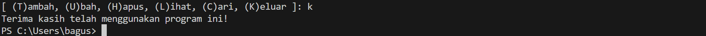

# praktikum_5

Nama: Bagus Sanjaya

NIM: 312410505

Kelas: TI.24.A.5

## Ini adalah penjelasan program yang saya buat

1. Inisialisasi
```python
import time

data_mahasiswa = {}
```
- Program dimulai dengan mengimpor modul time dan mendefinisikan dictionary data_mahasiswa untuk menyimpan data mahasiswa.

2. Fungsi Menghitung Nilai Akhir
```python
def hitung_nilai_akhir(tugas, uts, uas):
    return (tugas * 0.3) + (uts * 0.35) + (uas * 0.35)
```
- Fungsi hitung_nilai_akhir digunakan untuk menghitung nilai akhir mahasiswa berdasarkan nilai tugas, UTS, dan UAS dengan bobot masing-masing 30%, 35%, dan 35%.

3. Fungsi Menambah Data
```python
def tambah_data():
    nim = input("Masukkan NIM: ")
    nama = input("Masukkan Nama: ")
    tugas = float(input("Masukkan Nilai Tugas: "))
    uts = float(input("Masukkan Nilai UTS: "))
    uas = float(input("Masukkan Nilai UAS: "))
    nilai_akhir = hitung_nilai_akhir(tugas, uts, uas)
    data_mahasiswa[nim] = {"nama": nama, "tugas": tugas, "uts": uts, "uas": uas, "nilai_akhir": nilai_akhir}
    print("Data berhasil ditambahkan!")
    time.sleep(1)
```
- Fungsi ini meminta input NIM, nama, nilai tugas, nilai UTS, dan Nilai UAS dari pengguna.

- Menghitung nilai akhir menggunakan fungsi hitung_nilai_akhir dan menyimpan data dalam dictionary data_mahasiswa.

4. Fungsi Mengubah Data
```python
def ubah_data():
    nim = input("Masukkan NIM mahasiswa yang akan diubah: ")
    if nim in data_mahasiswa:
        print("Data saat ini:", data_mahasiswa[nim])
        nama = input("Masukkan Nama baru: ")
        tugas = float(input("Masukkan Nilai Tugas baru: "))
        uts = float(input("Masukkan Nilai UTS baru: "))
        uas = float(input("Masukkan Nilai UAS baru: "))
        nilai_akhir = hitung_nilai_akhir(tugas, uts, uas)
        data_mahasiswa[nim] = {"nama": nama, "tugas": tugas, "uts": uts, "uas": uas, "nilai_akhir": nilai_akhir}
        print("Data berhasil diubah!")
    else:
        print("Data tidak ditemukan.")
    time.sleep(1)
```

- Fungsi ini meminta NIM dari mahasiswa yang datanya ingin diubah.

- Jika NIM ditemukan dalam dictionary, fungsi akan meminta input data baru dan memperbarui data dalam dictionary.

- Jika NIM tidak ditemukan, akan menampilkan pesan bahwa data tidak ditemukan.

5. Fungsi Menghapus Data
```python
def hapus_data():
    nim = input("Masukkan NIM mahasiswa yang akan dihapus: ")
    if nim in data_mahasiswa:
        del data_mahasiswa[nim]
        print("Data berhasil dihapus!")
    else:
        print("Data tidak ditemukan.")
    time.sleep(1)
```
- Fungsi ini meminta NIM dari mahasiswa yang datanya ingin dihapus.

- Jika NIM ditemukan dalam dictionary, fungsi akan menghapus data dari dictionary.

- Jika NIM tidak ditemukan, akan menampilkan pesan bahwa data tidak ditemukan.

6. Fungsi Melihat Data
```python
def lihat_data():
    if data_mahasiswa:
        print("Daftar Nilai Mahasiswa")
        print("-----------------------------------------------------------------------------------------")
        print("| NO | NIM           | NAMA                 | TUGAS    | UTS      | UAS      | AKHIR    |")
        print("-----------------------------------------------------------------------------------------")
        for i, (nim, data) in enumerate(data_mahasiswa.items(), start=1):
            print(f"| {i:<2} | {nim:<13} | {data['nama']:<20} | {data['tugas']:<8.2f} | {data['uts']:<8.2f} | {data['uas']:<8.2f} | {data['nilai_akhir']:<8.2f} |")
            print("-----------------------------------------------------------------------------------------")
    else:
        print("Daftar Nilai Mahasiswa")
        print("-----------------------------------------------------------------------------------------")
        print("| NO | NIM           | NAMA                 | TUGAS    | UTS      | UAS      | AKHIR    |")
        print("-----------------------------------------------------------------------------------------")
        print("|                                    TIDAK ADA DATA                                     |")
        print("-----------------------------------------------------------------------------------------")
    time.sleep(1)
```
- Fungsi ini menampilkan data mahasiswa dalam format tabel.

- Jika dictionary data_mahasiswa kosong, akan menampilkan pesan "TIDAK ADA DATA".

7. Fungsi Mencari Data
```python
def cari_data():
    nim = input("Masukkan NIM mahasiswa yang dicari: ")
    if nim in data_mahasiswa:
        print("Data ditemukan:", data_mahasiswa[nim])
    else:
        print("Data tidak ditemukan.")
    time.sleep(1)
```
- Fungsi ini meminta NIM dari mahasiswa yang datanya ingin dicari.

- Jika NIM ditemukan dalam dictionary, fungsi akan menampilkan data mahasiswa.

- Jika NIM tidak ditemukan, akan menampilkan pesan bahwa data tidak ditemukan.

8. Fungsi Menu
```python
def menu():
    while True:
        pilihan = input("[ (T)ambah, (U)bah, (H)apus, (L)ihat, (C)ari, (K)eluar ]: ")

        if pilihan == 't':
            tambah_data()
        elif pilihan == 'u':
            ubah_data()
        elif pilihan == 'h':
            hapus_data()
        elif pilihan == 'l':
            lihat_data()
        elif pilihan == 'c':
            cari_data()
        elif pilihan == 'k':
            print("Terima kasih telah menggunakan program ini!")
            break
        else:
            print("Pilihan tidak valid, silakan coba lagi.")
        time.sleep(1)
```
- Fungsi ini menampilkan menu pilihan kepada pengguna.

- Memanggil fungsi yang sesuai berdasarkan input pengguna (t untuk tambah data, u untuk ubah data, h untuk hapus data, l untuk lihat data, c untuk cari data, k untuk keluar).

9. Blok if __name__ == "__main__"::

- Baris if __name__ == "__main__": digunakan untuk memeriksa apakah file Python tersebut dijalankan langsung atau diimpor sebagai modul.

- Jika file dijalankan langsung, maka blok kode di dalam if akan dieksekusi.

- Jika file diimpor sebagai modul dalam file lain, blok kode di dalam if tidak akan dieksekusi.

10. Memanggil Fungsi menu():

- Di dalam blok if, terdapat panggilan untuk fungsi menu().

- Fungsi menu() adalah fungsi utama yang menampilkan menu pilihan kepada pengguna dan memungkinkan mereka untuk menambah, mengubah, menghapus, menampilkan, dan mencari data mahasiswa.


## Ini adalah hasil pemogramannya

### Tambah data jika kosong


### Tambah data yang sudah ada dan lihat data


### Ubah data dan lihat data


### Hapus data dan lihat data


### Cari data 


### keluar dari program



### Pilihan tidak valid


## Ini adalah penjelasan flowchart yang saya buat

1. Mulai

2. Mempersiapkan tempat untuk menyimpan data mahasiswa, yaitu menggunakan dictionary data_mahasiswa.

3. Program menampilkan menu pilihan kepada pengguna, yang berisi opsi untuk menambah data, mengubah data, menghapus data, melihat data, mencari data, dan keluar dari program sekaligus pengguna memilih salah satu opsi dari menu yang ditampilkan (t, u, h, l, c, k).

4. Jika pengguna memasukan "t"

- Program meminta input NIM, Nama, Nilai Tugas, Nilai UTS, dan Nilai UAS dari pengguna.

- Program menghitung nilai akhir berdasarkan input tersebut.

- Program menyimpan data yang diinput ke dalam dictionary data_mahasiswa.

- kembali otomatis ke no3

5. Jika pengguna memasukan "u"

- Program meminta input NIM dari mahasiswa yang datanya ingin diubah.

- Jika NIM ditemukan dalam dictionary, program meminta input data baru dan memperbarui data pada dictionary data_mahasiswa.

- Jika NIM tidak ditemukan, program menampilkan pesan bahwa data tidak ditemukan.

- Kembali otomatis ke no3

6. Jika pengguna memasukan "h"

- Program meminta input NIM dari mahasiswa yang datanya ingin dihapus.

- Jika NIM ditemukan dalam dictionary, program menghapus data tersebut dan memperbarui data pada dictionary data_mahasiswa.

- Jika NIM tidak ditemukan, program menampilkan pesan bahwa data tidak ditemukan.

7. Jika pengguna memasukan "l"

- Jika data tersebut sudah dimasukan oleh pengguna maka akan menampilkan semua data mahasiswa yang ada dalam dictionary data_mahasiswa dalam format tabel.

- Jika data tersebut belum dimasukan oleh pengguna maka program menampilkan pesan bahwa tidak ada data.

8. Jika pengguna memasukan "c"

- Program meminta input NIM dari mahasiswa yang datanya ingin dicari.

- Jika NIM ditemukan dalam dictionary, program menampilkan data mahasiswa tersebut.

- Jika NIM tidak ditemukan, program menampilkan pesan bahwa data tidak ditemukan.

9. Jika pengguna memasukan "k"

Program mengakhiri eksekusi dan keluar.

10. Jika pengguna memasukan selain (t, u, h, l, c, k,)

- Tampilkan pilihan tidak valid, silakan coba lagi.

- Kembali otomatis ke no3

## Ini adalah flowchart yang saya buat


